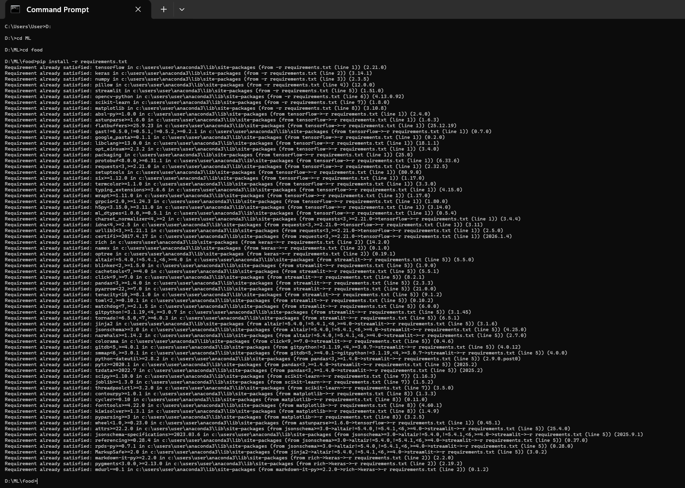
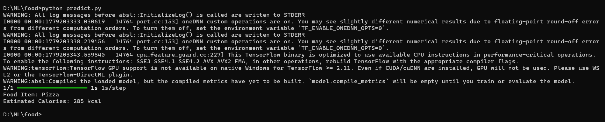
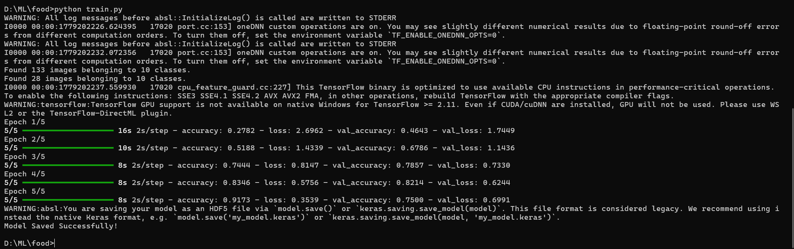
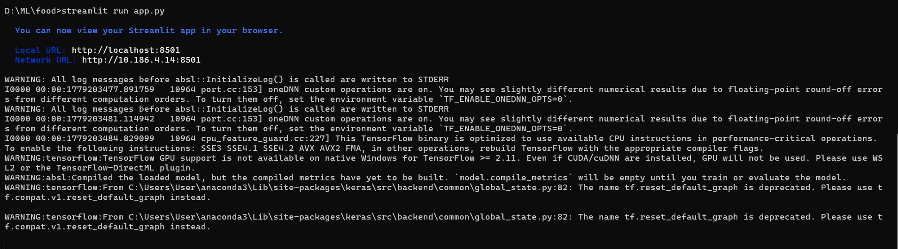
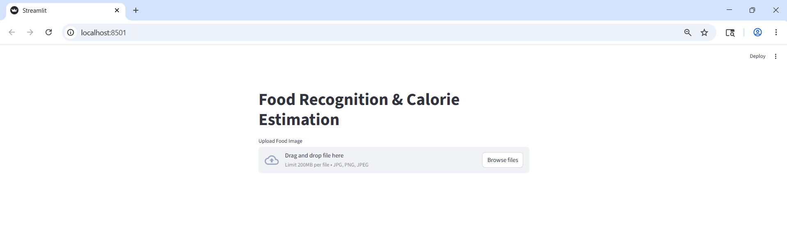
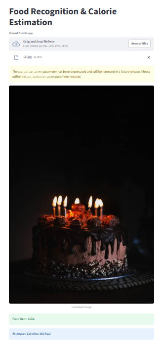
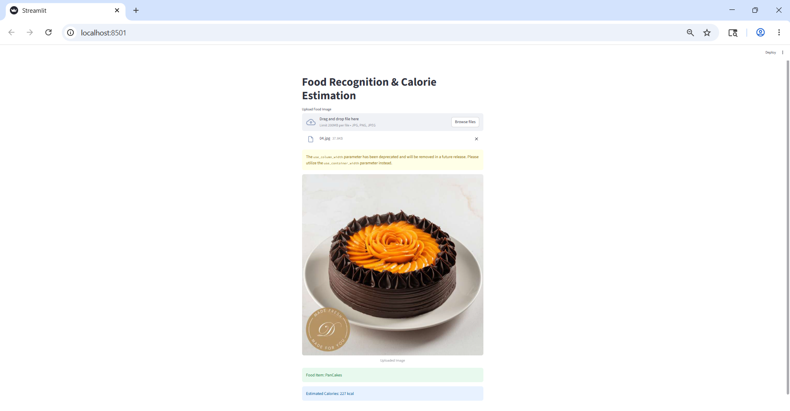

# 🍔 Food Recognition & Calorie Estimation System

## 📌 Prodigy Infotech ML Internship Task-05 (Final Task)

This project is a Deep Learning based Food Recognition and Calorie Estimation System developed using TensorFlow and MobileNetV2.

The model can identify food items from images and estimate their calorie content, helping users track dietary intake and make healthier food choices.

---

# 🚀 Features

✅ Food Image Classification  
✅ Calorie Estimation  
✅ Deep Learning using MobileNetV2  
✅ Transfer Learning  
✅ Streamlit Web Application  
✅ Image Upload Prediction System  

---

# 🛠 Technologies Used

- Python
- TensorFlow
- Keras
- NumPy
- OpenCV
- Streamlit
- Matplotlib

---

# 📂 Dataset

Dataset used:
Food-101 Dataset from Kaggle

https://www.kaggle.com/dansbecker/food-101

Custom dataset folder used:
`Food Images`

---

# 🍕 Food Classes

- Burger
- Cake
- Cookies
- HotDog
- IceCream
- PanCakes
- Pie
- Pizza
- Sandwich
- Sushi

---

# 📁 Project Structure

```bash
PRODIGY_ML_05/
│
├── models/
│   └── food_model.h5
│
├── screenshots/
│   ├── install_requirements.png
│   ├── prediction_output.png
│   ├── training_output.png
│   ├── streamlit_output1.png
│   ├── streamlit_output2.png
│   ├── streamlit_output3.png
│   └── streamlit_output4.png
│
├── Food Images.zip
├── test.jpg
├── train.py
├── predict.py
├── app.py
├── requirements.txt
├── README.md
├── LICENSE
└── .gitignore
```

---

# ⚙️ Installation

## Install Dependencies

```bash
pip install -r requirements.txt
```

---

# ▶️ Run Project

## Train Model

```bash
python train.py
```

## Predict Food Item

```bash
python predict.py
```

## Run Streamlit App

```bash
streamlit run app.py
```

---

# 🖼 Sample Test Image

A sample image named `test.jpg` is included in the project for prediction testing.

Example usage:

```bash
python predict.py
```

The model uses:

```python
img_path = "test.jpg"
```

to predict the food item and estimate calorie content.

---

# 📸 Screenshots

## 🔹 Requirements Installation



---

## 🔹 Model Prediction Output



---

## 🔹 Training Output



---

## 🔹 Streamlit App Output









---

# 📌 Project Output

Example:

```bash
Food Item: Pizza
Estimated Calories: 285 kcal
```

---

# 📌 Note

Only sample dataset images are uploaded to GitHub to reduce repository size.

---

# 👩‍💻 Author

Pratiksha Uchil

---

# 📜 License

This project is licensed under the MIT License.
